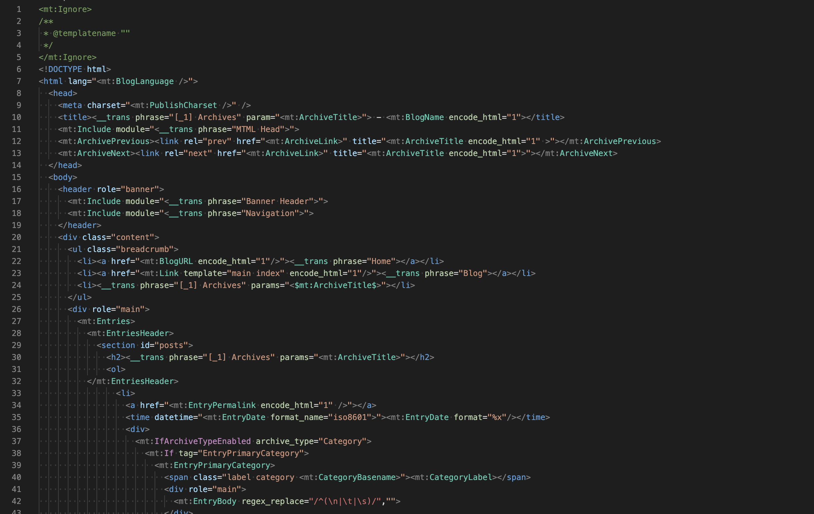

## Overview

Syntax highlight and Snippets for Movable Type Markup Language (MTML)

## Features

Works with .mtml extension

- Syntax Highlighting
- Provide Snippets

### Syntax Highlight

Highlight in `Dark+(default dark)` vscode theme

#### tmLanguage Naming Conventions

| 要素           | scope name                   |
| :------------- | :--------------------------- |
| mt tag         | entity.other.inherited-class |
| mt control tag | keyword.control              |
| modifier       | constant.numeric             |
| ignore         | comment.block                |
| quoted string  | string.quoted                |

### Snippets

- Movable Type
- Movable Type.net
- PowerCMS

## Forked from

- Syntax Highlighting - [yupyom/vscode-movabletype](https://github.com/yupyom/vscode-movabletype/tree/0.1.0)
- Snippets - [hei-a/html.json](https://gist.github.com/hei-a/73c9ccdad642b64d6d1c03b629ee14c7)
