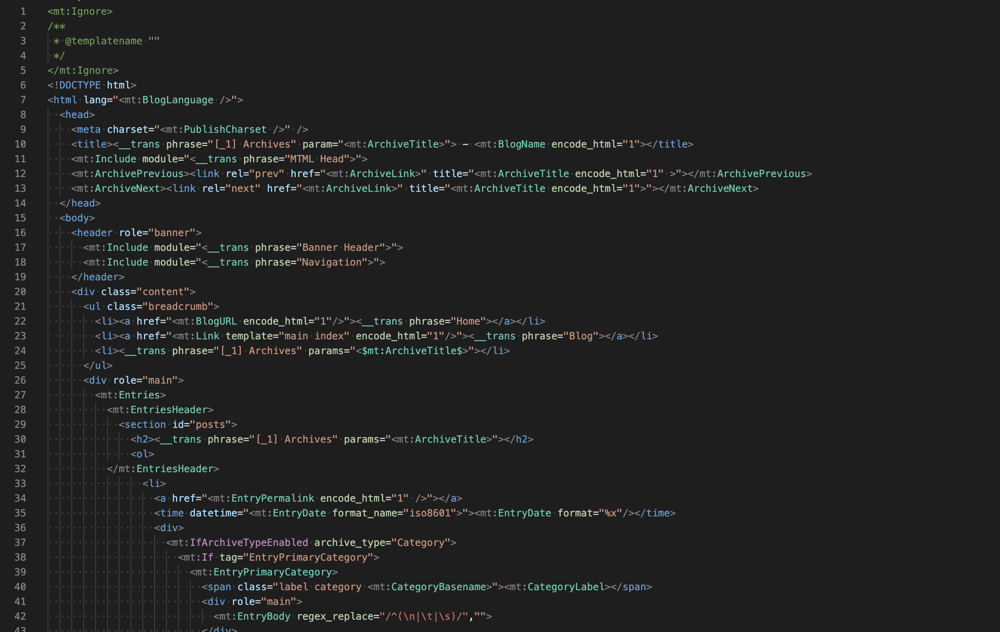
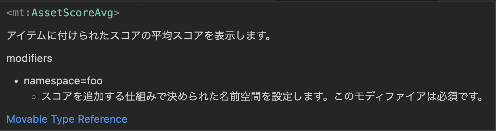
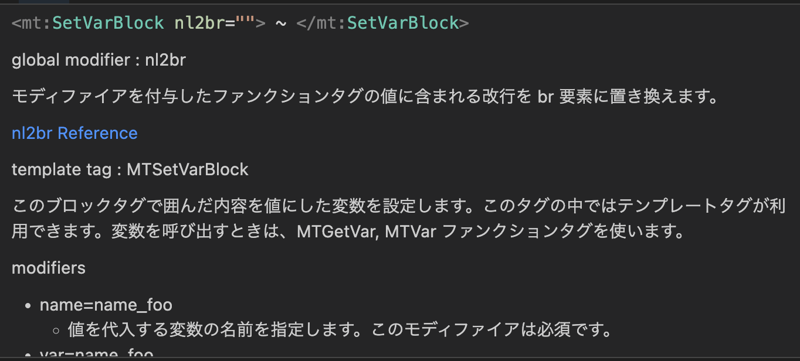
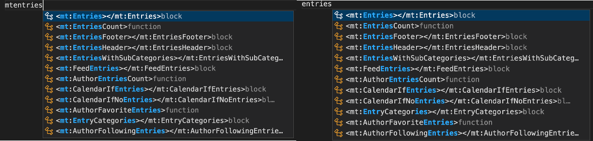
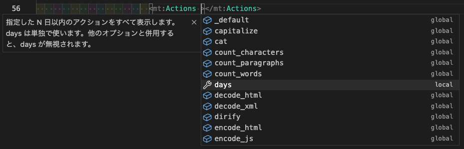
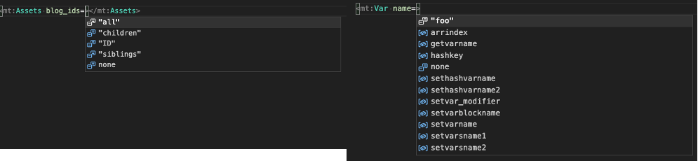

# mtml language provider

[README.en.md](./README.en.md)

この拡張機能は以下の機能を提供します。

- highlight
- hover
- completion
- definition(beta)

以下の CMS の mt タグ、モディファイアを使用できます。

- Movable Type
- Movable Type.net
- PowerCMS
- PowerCMS X

## Features

mtml 拡張子のファイルで動作します。

### Syntax Highlight

`Dark+(規定の Dark)`でのハイライト

### Hover

カーソルが mt タグにホバーした時はタグの説明を表示します。
カーソルがグローバルモディファイアにホバーした時はモディファイアの説明とタグの説明を表示します。
`editor.hover.enable:false`を設定ファイルに書くと機能をオフにできます。

### Completionタグの外側では MT タグを補完候補として挙げます。

タグの内側で半角スペースを打ったときに MT タグのモディファイアとグローバルモディファイアを補完候補として挙げます。
モディファイアの後ろで `=` を打ったときにモディファイアのとりうる値を補完候補としてあげます。
また、モディファイアが `name, var, setvar` だったときにはファイル内の変数名も一緒に補完候補としてあげます。
さらに、モディファイアの `""` のなかで `$` を打ったときも同様にファイル内の変数名を補完候補としてあげます。
`mtml.completion.enable:false`を設定ファイルに書くとこの機能をオフにできます。

### Definition(beta)

この機能はベータ版です。
MTVar などの変数定義タグによるユーザー変数へジャンプします。
同一ファイル内の変数のみジャンプ可能です。
この機能はデフォルトでオフになっています。
使いたい場合は`mtml.definition.enable:true`を設定ファイルに書いてください。

## Extension Settings

この拡張機能は以下の設定をサポートします:

- `mtml.completion.enable`: completion feature
  - `true`: enable
  - `false`: disable
- `mtml.definition.enable`: definition feature
  - `true`: enable
  - `false`: disable
- `mtml.cms.type`: What is your CMS? Select after.
  - `Movable Type` default
  - `Movable Type.net`
  - `PowerCMS`
  - `PowerCMS X`

## Super Thanks

- Syntax Highlighting - [yupyom/vscode-movabletype](https://github.com/yupyom/vscode-movabletype/tree/0.1.0)
- My sponsors - [github sponsors](https://github.com/sponsors/fhiromasa)
