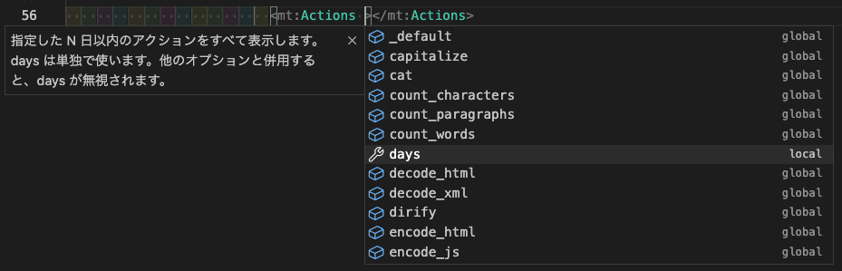

## Overview

This extension provide these features.

この拡張機能は以下の機能を提供します。

- highlight
- hover
- completion
- definition(beta)

You can use these CMS' tags and modifiers.

以下の CMS の mt タグ、モディファイアを使用できます。

- Movable Type
- Movable Type.net
- PowerCMS
- PowerCMS X

## Features

Works with `*.mtml` files.

mtml 拡張子のファイルで動作します。

### Syntax Highlight

Highlight in `Dark+(default dark)` vscode theme.

`Dark+(規定の Dark)`でのハイライト


### Hover

Display the tag description when the cursor hovers over the tag.
Show tag description and global modifier description when the cursor hovers over a global modifier.
If you want to disable this feature, Set `editor.hover.enable:false` in `.vscode/settings.json`.

カーソルが mt タグにホバーした時はタグの説明を表示します。
カーソルがグローバルモディファイアにホバーした時はモディファイアの説明とタグの説明を表示します。
`editor.hover.enable:false`を設定ファイルに書くと機能をオフにできます。


### Completion

Outside the tag, the tag is given as a completion candidate.
When you hit a `half-width` space inside the tag, MT tag modifiers and global modifiers are listed as completion candidates.
When you hit `=` after the modifier, the possible values ​​of the modifier are given as completion candidates. Also, when the modifier is `name, var, setvar`, the variable name in the file is also given as a completion candidate. Furthermore, when you hit `$` in the modifier's `""`, the variable names in the file are also given as completion candidates.
If you want to disable this feature, Set `mtml.completion.enable:false` in `.vscode/settings.json`.

タグの外側では MT タグを補完候補として挙げます。
タグの内側で半角スペースを打ったときに MT タグのモディファイアとグローバルモディファイアを補完候補として挙げます。
モディファイアの後ろで `=` を打ったときにモディファイアのとりうる値を補完候補としてあげます。
また、モディファイアが `name, var, setvar` だったときにはファイル内の変数名も一緒に補完候補としてあげます。
さらに、モディファイアの `""` のなかで `$` を打ったときも同様にファイル内の変数名を補完候補としてあげます。
`mtml.completion.enable:false`を設定ファイルに書くとこの機能をオフにできます。





### Definition

This feature is in beta.
Jump to user variables with variable definition tags such as MTVar.
Only variables within the same file can be jumped.
This feature is turned off by default. If you want to enable this feature, Set `mtml.definition.enable:true` in `.vscode/settings.json`.

この機能はベータ版です。
MTVar などの変数定義タグによるユーザー変数へジャンプします。
同一ファイル内の変数のみジャンプ可能です。
この機能はデフォルトでオフになっています。
使いたい場合は`mtml.definition.enable:true`を設定ファイルに書いてください。

## Extension Settings

This extension contributes the following settings:

この拡張機能は以下の設定をサポートします:

- `mtml.completion.enable`: completion feature
  - `true`: enable
  - `false`: disable
- `mtml.definition.enable`: definition feature
  - `true`: enable
  - `false`: disable
- `mtml.cms.type`: What is your CMS? Select after.
  - `Movable Type` default
  - `Movable Type.net`
  - `PowerCMS`
  - `PowerCMS X`

## Super Thanks

- Syntax Highlighting - [yupyom/vscode-movabletype](https://github.com/yupyom/vscode-movabletype/tree/0.1.0)
- My sponsors - [github sponsors](https://github.com/sponsors/fhiromasa)

## About Data

The json file in src/data was created in the [mtmlItemMaker repository](https://github.com/fhiromasa/mtmlItemMaker).
I don't use anything other than `item.ts or json` for this extension.
Since mtmlItemMaker repository is used as a submodule, it is necessary to update it with the following command.

`src/data/**/*.json` ファイルは [mtmlItemMaker](https://github.com/fhiromasa/mtmlItemMaker) のリポジトリで作ったものです。
`item.ts と json` 以外はこの拡張機能として使っていません。
このリポジトリをサブモジュールとして使っているので以下のコマンドでたまにアップデートが必要です？

```sh
$ git submodule update
```
