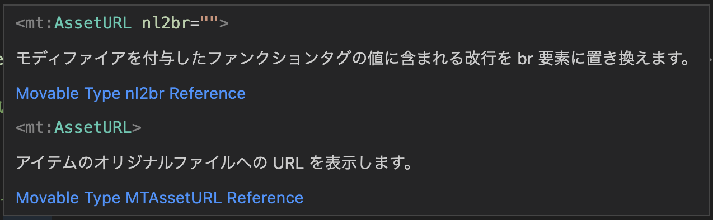

## Overview

This extension provide these features.(この拡張機能は以下の機能を提供します。)

- highlight
- hover
- completion

You can use these CMS' tags and modifiers.(以下のCMSのmtタグ、モディファイアを使用できます。)

- Movable Type
- Movable Type.net
- PowerCMS
- PowerCMS X

## Features

Works with `*.mtml` files.(mtml拡張子のファイルで動作します。)

### Syntax Highlight

Highlight in `Dark+(default dark)` vscode theme.(Dark＋(規定のDark)でのハイライト)

#### tmLanguage Naming Conventions

| element        | scope name                   |
| :------------- | :--------------------------- |
| mt tag         | entity.other.inherited-class |
| mt control tag | keyword.control              |
| modifier       | constant.numeric             |
| ignore         | comment.block                |
| quoted string  | string.quoted                |

### Hover

Display the tag description when the cursor hovers over the tag.(カーソルがmtタグにホバーした時はタグの説明を表示します。)

If you want to disable this feature, Set `mtml.hover.enable:false` in `.vscode/settings.json`.(この機能をオフにしたければ`mtml.hover.enable:false`を設定ファイルに書いてください。)

Show tag description and global modifier description when the cursor hovers over a global modifier.(カーソルがグローバルモディファイアにホバーした時はモディファイアの説明とタグの説明を表示します。)

### Completion

Outside the tag, the tag is given as a completion candidate.(タグの外側ではMTタグを補完候補として挙げます。)

Inside the tag, tag modifiers and global modifiers are given as completion candidates.(タグの内側ではMTタグのモディファイアとグローバルモディファイアを補完候補として挙げます。)

If you want to disable this feature, Set `mtml.completion.enable:false` in `.vscode/settings.json`.(この機能をオフにしたければ`mtml.completion.enable:false`を設定ファイルに書いてください。)

## Extension Settings

This extension contributes the following settings(この拡張機能は以下の設定をサポートします):

- `mtml.hover.enable`: hover feature
  - true: enable
  - false: disable
- `mtml.completion.enable`: completion feature
  - true: enable
  - false: disable
- `mtml.cms.type`: What is your CMS? Select after.
  - `Movable Type` default
  - `Movable Type.net`
  - `PowerCMS`
  - `PowerCMS X`

## Super Thanks

- Syntax Highlighting - [yupyom/vscode-movabletype](https://github.com/yupyom/vscode-movabletype/tree/0.1.0)
